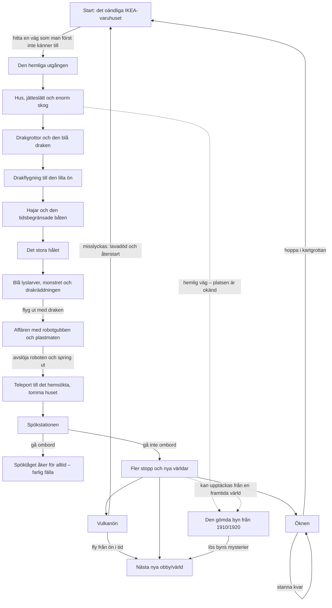

# IKEA 3:33 – världsbibel

## Vad spelet ska kännas som

Det här är ett stort 3D-äventyr för två kusiner. Spelet ska vara **lite läskigt, väldigt roligt och fullt av överraskningar**. Världen ska kännas levande och verklig, men berättelsen får vara mystisk, magisk och konstig.

**Alla idéer i den här världsbibeln ska finnas i ett och samma sammanhängande spel.** IKEA, skogen, drakarna, ön, hålet, affären, huset, tåget, öknen, vulkanen och den gamla byn är olika delar av samma stora resa, inte olika spel.

Spelet ska hela tiden kunna få nya världar och nya obby-banor. Det ska kännas nästan oändligt: först ett IKEA som man kan gå väldigt långt i, sedan enorma utomhusområden och därefter fler och fler världar.

### Viktigt om status

- **Idéstatus: bekräftad** betyder att idén har sagts och godkänts av spelets skapare.
- **Byggstatus: ej verifierad** betyder att den här filen inte påstår att funktionen redan finns i den spelbara versionen.
- Allt under **Bekräftad spelvision** är alltså spelkrav och berättelseidéer, inte en lista över färdig kod.
- När något är byggt och testat kan dess byggstatus ändras separat.

## Bekräftad spelvision

### Grundformat

- Hela spelet ska spelas i förstapersonsperspektiv: spelaren ser världen genom sin egen spelfigurs ögon.
- Spelet ska vara i 3D med bra, högupplöst grafik.
- Det ska **inte** vara en pixelvärld.
- Det ska kännas stort och välgjort, med samma sorts stora 3D-äventyrskänsla som det tidigare Zelda-liknande spelet och kvalitetskänslan i *The Lost Diamond*, utan att kopiera något av spelen.
- Världen ska vara ungefär "100 gånger större" i känsla och nästan aldrig ta slut.
- Det ska finnas riktiga skuggor och många små detaljer i miljön, till exempel detaljerat gräs.
- Det ska gå att spela som två personer, även online.
- Det ska alltid kunna komma fler obby-banor och världar senare.
- All vanlig text, alla instruktioner och all dialog i spelet ska vara på svenska.
- Undantaget är vissa gamla skyltar och föremål i den mystiska byn. De får ha engelsk text eftersom språket är en del av mysteriet.

**Idéstatus:** bekräftad
**Byggstatus:** ej verifierad

## Världs- och kapitelflöde

Flödet visar den bekräftade huvudidén. Exakt hur öknen, vulkanön, den gömda byn och andra framtida världar fördelas mellan tågets stopp är ännu inte bestämt. De ska därför kunna kopplas om utan att berättelsen går sönder. De streckade vägarna till byn visar möjliga hemliga kopplingar, inte bestämda ingångar.

## Kapitel 1 – Det oändliga IKEA-varuhuset

- Spelarna börjar i ett IKEA.
- IKEA ska kännas som att det fortsätter hur långt som helst och aldrig tar slut.
- Det finns inga vanliga, färdiga rum där inne. Det är stora, gamla ytor med väldigt många gamla möbler.
- Någonstans finns ett ställe eller en väg som spelarna ska ta sig till, men i början vet de inte var det är.
- Den gömda vägen leder till slut ut ur IKEA.
- Gamla möbler ska gå att flytta och använda för att bygga gömställen.
- På nätterna kommer ett läskigt monster.
- Exakt klockan **03:33 varje IKEA-natt** börjar monstret leta efter spelarna och försöker ta eller äta dem.
- Spelarna måste hinna bygga och gömma sig bland möblerna.
- IKEA-monstret är samma återkommande monster som senare syns i hålet, utanför huset och i öknen.

**Idéstatus:** bekräftad
**Byggstatus:** ej verifierad

## Kapitel 2 – Den enorma världen utanför

- När spelarna hittar vägen ut finns hus utspridda över världen.
- Utanför finns en jättestor slätt eller landyta, ungefär tio gånger större i känsla än området före den.
- Där finns mycket stora skogar.
- Skogarna ska vara så stora att spelarna måste försöka att inte tappa bort sig.
- Det finns monster i skogen.
- Det finns grottor med drakar.
- Huvudmålet är att hitta **den blå draken**.
- När spelarna hittar den blå draken ska de kunna flyga därifrån med den.
- Draken tar dem till en särskild, okänd plats där nästa nya obby börjar.

**Idéstatus:** bekräftad
**Byggstatus:** ej verifierad

## Kapitel 3 – Den lilla ön, hajarna och båten

- Den blå draken tappar eller släpper av spelarna på en liten ö.
- Spelarna kan inte lämna ön på vanligt sätt. De måste vänta tills en båt kommer.
- Havet runt ön är fullt av hajar som försöker äta spelarna.
- När båten närmar sig försvinner hajarna, eftersom de är rädda för båten.
- Båten stannar inte länge.
- Spelarna måste simma så snabbt de kan, hinna fram, hoppa ombord och följa med innan båten åker.
- Vad som händer om en eller båda spelarna missar båten är ännu inte bestämt. Grundidén är att båten är en spännande tidsutmaning.

**Idéstatus:** bekräftad
**Byggstatus:** ej verifierad

## Kapitel 4 – Det stora hålet

- Efter att spelarna har kommit bort från ön ramlar de ner i ett stort hål.
- I hålet finns små magiska larver.
- Larverna lyser elektriskt blått på nätterna.
- Spelarna ska försöka klättra ut ur hålet.
- Där finns det återkommande monstret från IKEA.
- Monstret försöker äta spelarna.
- Där finns också en stor blå drake.
- Den blå draken räddar spelarna från monstret.
- Efter räddningen flyger spelarna ut ur hålet med draken.

**Idéstatus:** bekräftad
**Byggstatus:** ej verifierad

## Kapitel 5 – Affären där allt är falskt

- Efter flykten ur hålet kommer spelarna till en affär.
- Affären har ingen vanlig ägare.
- Där finns bara en gammal gubbe som vinkar och säger: **"Hej, hej, hej, hej."**
- Först verkar han bara fortsätta vinka.
- Spelarna märker att han aldrig vänder sin högra sida mot dem.
- När han till slut vänder sig åt höger ser spelarna knappar på hans högra sida.
- Då förstår de att gubben egentligen är en robot.
- De upptäcker också att all mat i affären är låtsasmat av plast.
- När sanningen avslöjas springer spelarna ut.

**Idéstatus:** bekräftad
**Byggstatus:** ej verifierad

## Kapitel 6 – Det hemsökta, tomma huset

- Efter robotaffären teleporteras spelarna till ett hemsökt hus.
- Huset är helt tomt och saknar möbler när spelarna kommer dit.
- Inne i huset är spelarna fria och säkra till en början; där inne finns inget monster.
- Samma monster som fanns i IKEA och hålet väntar utanför huset.
- Ett av husets rum är ett förråd.
- Förrådet innehåller oändligt många gamla möbler.
- Spelarna ska bära ut möbler och bygga upp samt förstärka huset.
- Målet är att skapa ett så starkt skydd att monstret inte kan komma in och äta spelarna.

**Idéstatus:** bekräftad
**Byggstatus:** ej verifierad

## Kapitel 7 – Spökstationen och tågets val

- Efter det hemsökta huset spawnar spelarna vid en tågstation.
- Ett spöktåg kommer, stannar och öppnar dörrarna.
- Tåget ser helt tomt ut.
- Spelarna får själva välja om de vill gå in eller stanna kvar.
- Om de går ombord kan de inte gå ut igen.
- Tåget tar dem inte till en vanlig destination utan fortsätter bara att åka och åka för alltid.
- Det finns ingen mat ombord.
- Därför är det farliga valet att gå in, och det bästa valet enligt grundidén är att inte gå ombord.
- Om spelarna inte går in kommer fler stopp eller möjligheter.
- Vid de fortsatta stoppen ska det finnas helt nya världar kopplade till tåget.
- Den exakta regeln för hur spelarna besöker dessa världar utan att fastna på tåget är ännu inte bestämd.

**Idéstatus:** bekräftad
**Byggstatus:** ej verifierad

## Kapitel 8 – Öknen och portalen tillbaka

- Spelarna spawnar i en öken.
- Öknen är stor, men någonstans tar den slut eller har en väg vidare.
- Någonstans i öknen finns en liten grotta som spelarna kan hoppa ner i.
- Grottans plats går att se på spelarnas karta, även om den kan vara svår att hitta i själva landskapet.
- Grottan är en portal tillbaka till den första spawnplatsen i IKEA.
- Spelarna får välja mellan att stanna kvar i öknen eller hoppa ner och återvända till IKEA.
- På nätterna kommer monster upp ur sanden och försöker äta spelarna.
- Det är samma sorts monster som i IKEA, hålet och vid huset.
- Om spelarna inte hittar grottan måste de försöka överleva ökennätterna.

**Idéstatus:** bekräftad
**Byggstatus:** ej verifierad

## Kapitel 9 – Vulkanön

- Spelarna spawnar på en ö med en vulkan, inte inne i själva vulkanen.
- Vulkanen kommer att få ett utbrott.
- Spelarna får inte veta den exakta tiden i förväg.
- Innan utbrottet börjar ska de kunna höra varningsljud från vulkanen.
- När varningarna kommer måste de försöka fly från ön innan vulkanen exploderar.
- Om de inte hinner fly dödas de av den mycket heta lavan och återvänder eller respawnar i IKEA.
- Om de hinner undan fortsätter resan till en ny obby eller värld.

**Idéstatus:** bekräftad
**Byggstatus:** ej verifierad

## Hemligt kapitel – Den gamla byn

- Någonstans i den stora spelvärlden finns en gömd, gammal by.
- Spelarna ska inte få veta i förväg var byn ligger.
- Byn är ungefär 100–200 år gammal.
- När spelarna utforskar byn ska de upptäcka mysterier som blir konstigare och konstigare.
- Det räcker inte att bara hitta sakerna. Spelarna ska försöka förstå ledtrådarna och lösa vad som har hänt i byn.
- En gammal engelsk skylt är kopplad till byn. Den bekräftade formuleringen är **"VILLAGE FROM 1920"**.
- Årtalet har också berättats som **1910**. Båda uppgifterna ska bevaras tills skaparna bestämmer vilken som är sann.
- Skillnaden mellan 1910 och 1920 kan användas som en av byns mystiska ledtrådar: kanske säger olika skyltar eller föremål olika saker, men den exakta förklaringen ska inte hittas på ännu.
- Byn följer spelets språkregel: spelet är på svenska, men gamla skyltar och föremål där får vara på engelska.
- Den gamla byn tillhör samma berättelse som alla andra kapitel, även om dess exakta plats och ingång är hemliga.

**Idéstatus:** bekräftad
**Byggstatus:** ej verifierad

## Tid, väder och naturkatastrofer

- Världen ska ha en tydlig dag- och nattcykel.
- Ibland ska det vara soligt och ibland molnigt.
- Ibland ska det regna.
- Ibland ska regnbågar synas.
- Ibland ska tornador dyka upp.
- Ibland ska en tsunami komma in från havet och skölja över land.
- När en tsunami kommer ska spelarna försöka springa upp på berg eller annan hög mark.
- Väder och katastrofer ska komma ibland, inte hela tiden.
- Vädret, ljuset och skuggorna ska få världen att kännas som en riktig värld.
- Exakta varningar, styrkor och följder för tornador är ännu inte bestämda.

**Idéstatus:** bekräftad
**Byggstatus:** ej verifierad

## Ljudvärld

- Man ska kunna höra vinden blåsa.
- Man ska kunna höra hajarna runt ön.
- Man ska kunna höra fåglar kvittra.
- Regn, oväder, vatten och andra viktiga händelser ska höras tydligt.
- Vulkanen ska ge hörbara varningar innan utbrottet.
- Ljuden ska hjälpa spelarna att förstå vad som händer, men också göra världen mer levande och ibland läskigare.

**Idéstatus:** bekräftad
**Byggstatus:** ej verifierad

## Det återkommande monstret

Det ska kännas som att samma skrämmande monster jagar spelarna genom flera världar:

- i IKEA klockan 03:33 varje natt,
- i det stora hålet,
- utanför det hemsökta huset,
- och ur sanden under ökennätterna.

Monstret binder ihop världarna och får spelarna att undra hur det alltid kan hitta dem. Det är inte bestämt ännu exakt hur monstret ser ut, vad det heter eller varför det följer efter spelarna.

**Idéstatus:** bekräftad
**Byggstatus:** ej verifierad

## Två spelare och online

- Spelet ska vara gjort för två personer som kan spela tillsammans.
- Det ska gå att spela online.
- Båda spelarna ska kunna utforska, gömma sig, bygga och försöka överleva.
- Exakta regler för återupplivning, delad progression, avstånd mellan spelarna och vad som händer om bara en spelare hinner till båten är ännu inte bestämda.

**Idéstatus:** bekräftad
**Byggstatus:** ej verifierad

## Saker som medvetet är öppna för fler idéer

Följande detaljer är inte bestämda och ska inte hittas på utan skaparnas nästa idéer:

- spelets slutliga namn,
- monstrets namn och utseende,
- exakt hur man hittar IKEA-utgången,
- var den gamla byn ligger och hur spelarna hittar dit,
- varför byns ledtrådar säger både 1910 och 1920,
- vilka märkliga mysterier byn döljer och hur de löses,
- exakt hur möbelbyggandet styrs,
- vad som händer om båten missas,
- hur tågets nya världar och stopp fungerar i detalj,
- hur vulkanön nås och vad nästa värld efter en lyckad flykt är,
- reglerna för tornado,
- vilka fler obby-banor och världar som läggs till senare.

## Implementationsöversikt

| Område | Bekräftad idé | Byggstatus i denna världsbibel |
|---|---:|---|
| Oändligt IKEA och 03:33-monster | Ja | Ej verifierad |
| Flyttbara gamla möbler och gömställen | Ja | Ej verifierad |
| Enorm skog, hus, grottor och blå drake | Ja | Ej verifierad |
| Liten ö, hajar och tidsbegränsad båt | Ja | Ej verifierad |
| Stort hål, blå lyslarver och drakräddning | Ja | Ej verifierad |
| Robotgubben och plastmaten | Ja | Ej verifierad |
| Tomt hemsökt hus och oändligt möbelförråd | Ja | Ej verifierad |
| Spökstation, farligt tågval och nya världar | Ja | Ej verifierad |
| Öken, nattmonster och kartgrotta till IKEA | Ja | Ej verifierad |
| Vulkanö med ljudvarning och IKEA-retur vid misslyckande | Ja | Ej verifierad |
| Gömda gamla byn, engelska skyltar och växande mysterier | Ja | Ej verifierad |
| Dag/natt, väder, tsunami och tornado | Ja | Ej verifierad |
| Förstaperson, högupplöst 3D, skuggor och detaljerad natur | Ja | Ej verifierad |
| Svenska i hela spelet, med engelska gamla byfynd som undantag | Ja | Ej verifierad |
| Alla kapitel sammanbundna i samma spel | Ja | Ej verifierad |
| Vind, fåglar, hajar och miljöljud | Ja | Ej verifierad |
| Två spelare och online | Ja | Ej verifierad |
